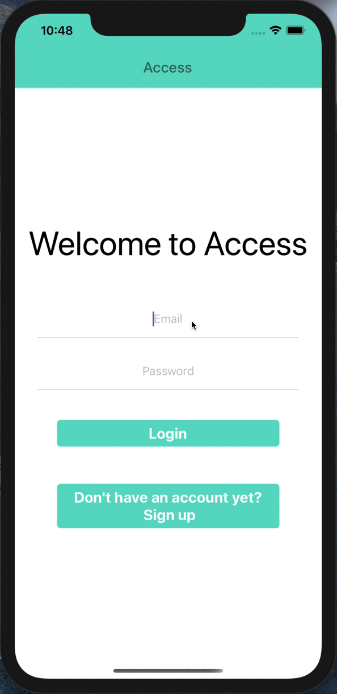
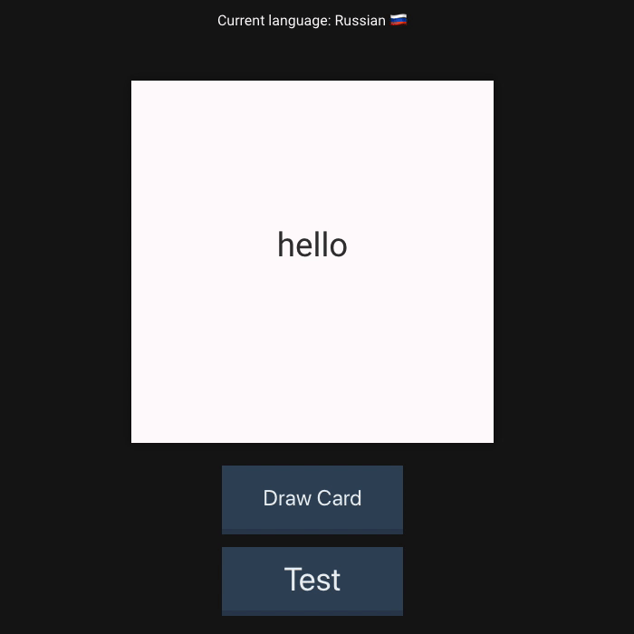
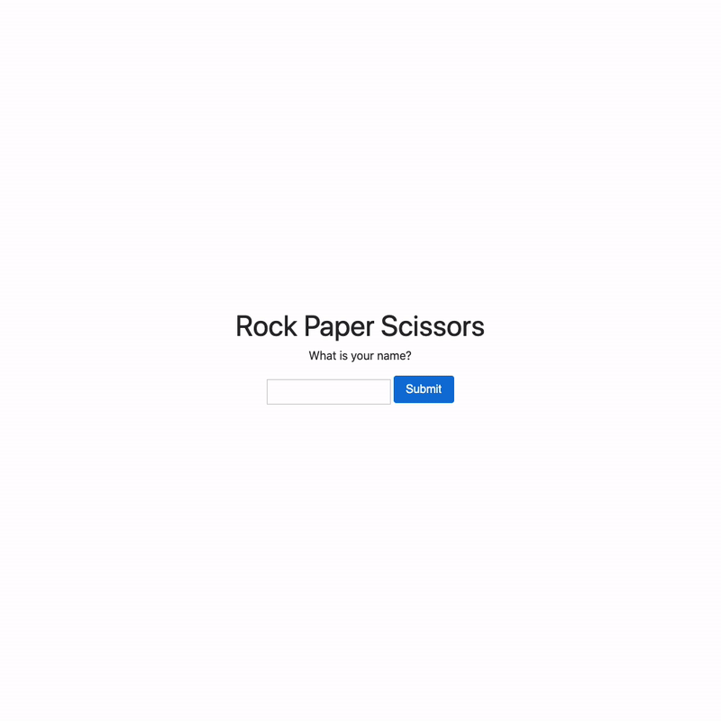
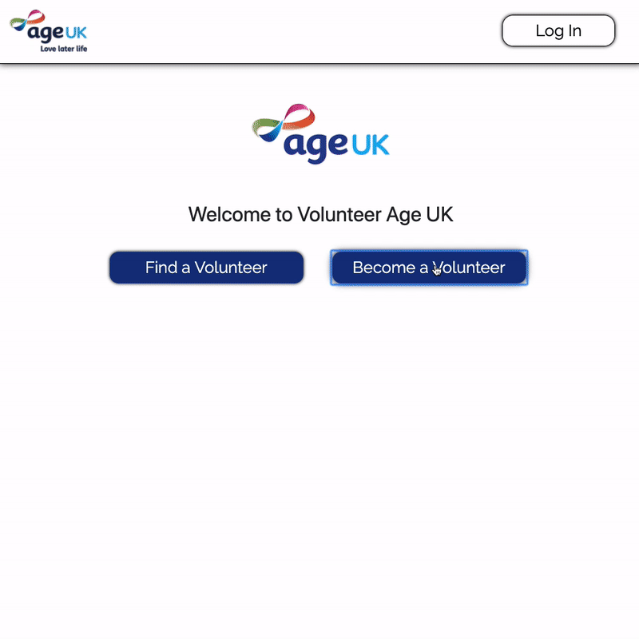

<h1 align="center"> David Stewart </h1>

[Skills](#skills) | [Dev Projects](#dev-projects) | [Education](#education) | [Experience](#experience) | [Hobbies](#hobbies)

I am goal driven software engineer with a curiosity to continually learn and develop my knowledge. I have recently graduated from Makers Academy, a highly selective coding bootcamp where I developed my ability to be an autodidact and become closer to being language-agnostic. I have realised that coding is not about knowing everything, it is about using what you do know to navigate new problems and use that knowledge flexibly to meander the challenging world of development!

I have always been interested in technology and taking things apart to better understand how they work. I was introduced to coding briefly at university while studying Aeronatuical Engineering but only recently dived into to developing prior to joining Makers. 

Through makers I have realised that the greatest challenge in coding is not writing it but working together seamlessly in a team and developing a congruent, aligned vision that everyone buys into. Once that is achieved, everything else flows naturally.

My goal in development is helping to create an environment that sparks joy: when the user interacts with the product, when pairing, during stand-ups and when sharing ideas. I took a year off after working in consulting for 6 months to reflect on how I could best be myself. I recognized that being mentally present, building an environment where people feel listened to and being genuinely open to others perspectives is what provides success. And I would like to bring this knowledge to my new workplace.

## Dev Projects
| Project           | Info            |
| :------------:     | :-------------         |
| [Access](https://github.com/DavidStewartLDN/access)   <a href="https://github.com/DavidStewartLDN/access">

</a> | <h4>Description</h4> A project I am leading to create an app to store your daily acheivements.  Team of 6 Makers students working to create a cross-platform app to be released to the Apple and Play store in November 2020   This app is designed to allow the user to record their successes that would otherwise dissappear in the busyness and rush of modern life.    Users are reminded to store their daily achievements through push notifications, with data being stored in Firebase with authentication   Timeframe: Continuous<h4>Development/Testing</h4>React Native Expo, Firebase, Redux <h4> |
| [Flashcards](https://github.com/DavidStewartLDN/react-flashcards)   <a href="https://github.com/DavidStewartLDN/react-flashcards">

</a> | <h4>Description</h4> A project to show the use of React and a database  Timeframe: Continuous<h4>Development/Testing</h4>JavaScript, NodeJS, ReactJS <h4> |
| [FirworksBnB](https://github.com/DavidStewartLDN/fireworksBnB)   <a href="https://github.com/DavidStewartLDN/fireworksBnB">

</a> | <h4>Description</h4> Team Project to create a Airbnb clone within a week time frame  Timeframe: 5 days <h4>Development/Testing</h4>Sinatra, Ruby, RSpec, Capybara<h4> |
| [Rock, Paper, Scissors](https://github.com/DavidStewartLDN/rps-challenge)   <a href="https://github.com/DavidStewartLDN/rps-challenge">

</a> | <h4>Description</h4> Project showing use of Sinatra and Ruby to make a simple Rock Paper Scissors application  Timeframe: 5 days <h4>Development/Testing</h4>Sinatra, Ruby, RSpec, Capybara <h4> |
| [Age UK Volunteer Matching](https://github.com/ratcliffetj/Age-UK-Volunteer-Matching)   <a href="https://github.com/ratcliffetj/Age-UK-Volunteer-Matching">

</a> | <h4>Description</h4> Second Place in Hackathon competition 'Hack for Heroes'.    This Project was designed to connect isolated people during the coronavirus public health pandemic with volunteers.    The volunteers can then connect to the vulnerable people in a similar style to an online dating app    Timeframe: 2 days <h4>Development</h4>Ruby on Rails, Heroku, Travis CI <h4> |

## Skills

#### Clear Communication style

During my work at Helios I developed my skills working with and presenting to clients. I have developed my ability to convey the key message I want to and pitching at the high level for the listener. Through my NLP course I have welcomed the idea that if someone is not understanding my message, I need to adapt what I am saying to fit their world map and listen to what they’re saying to see where I need to focus my words next. Through these experiences I feel I have changed from a more rigid communication style to a flexible approach that I can adapt to the context, to the people.

#### Teamwork
Through my previous work experience and more recently Makers, the biggest challenge is not usually what you need to do; it is more often the working together effortlessly and easily. This involves coordinating together, working in unison and all being congruent in wanting to achieve the same outcome. While working on group projects at Makers, I have seen the challenge you face when one person has a developed idea in their head and trying to transfer that vision to other people in the team. I have always enjoyed drawing out their vision by asking questions and listening, the more time I spend listening the more I stop projecting what I think onto peoples views and the more I actually know what I need to do in the team. I truly enjoy working with other people and always look for a win-win outcome when we may have diverging views, getting everyone to buy-in to a shared vision.

#### Self Learning
I have previously felt like I wasn’t a fast learner but in reality I had just not given myself the time to absorb the information. While at Makers I have finally blossomed into being able to self learn, at my own speed and keep researching and trying new things until they work. I enjoy leading my learning to help me understand the subject I am working on in detail and because I am leading it, I know what I need to work on and most importantly, to ask the people around me the right question to really catapult my understanding into the stratosphere.

#### Enthusiasm and positivity
I enjoy bringing I light hearted tilt to things while still being ground in the real and the possible. I like to bring positivity and an attitude that says things are possible - especially in the face of adversity. By keeping myself balanced and looking after myself through meditation and mindfulness, I am ale to bring my full positive self to a team and support other members where I can. Empathy is all too often underrated in high pace business environments but in reality fast progress and empathy for others are completely intertwined for success.

## Education

#### Makers Academy (January to April)

- Object-oriented programming, test driven development, pair-programming, agile project management and many more.
- Languages - Ruby, JavaScript, Python, SQL
- Frameworks & Libraries - Rails, Sinatra, OpenCV, Caffe, Node.js, jQuery, React
- Testing Frameworks - RSpec & Jasmine

#### University of Southampton (2014 to 2017)

- Aeronautical Engineering
- First Class Honours [1st]

#### Purdue University, Indiana (Sem 2016)

- Aeronautical Engineering
- GPA 3.52
- Studied abroad for one semester

#### Abingdon Boys School, 2007 - 2014

- A Level: Maths, Economics and Physics - A*
- AS Level: Geography - B
- Squash team and CCF

#### Any other qualifications

Neuro Linguistic Programming (NLP) Practitioner

## Experience

**Helios** (September 2018 to February 2019)    
*Analyst Consultant*  
- Worked within the air traffic management sector presenting and writing reports for a client facing role
- Created a excel workbook for analsysing Cost Benefit Analysis for a large European airport investing in a digital tower contingency solution.

**Carbon Credentials** (April 2018 to August 2018)   
*Analyst Engineering Intern*  
- Used data driven insights to help reudce CO2 emissions and energy consumption for clients.
- Compeleted regression analysis in excel and used advanced functions to clean up excel.
- Created a Tableau workbook to visualize the differing cost of energy for clients based on time and location.

## Hobbies

- Yoga - to stretch out so you can focus on your work.
- Meditation - Keeping the mild clear so you can stay on course.
- Sustainability - Working out how we solve this puzzle that is Climate Change.
